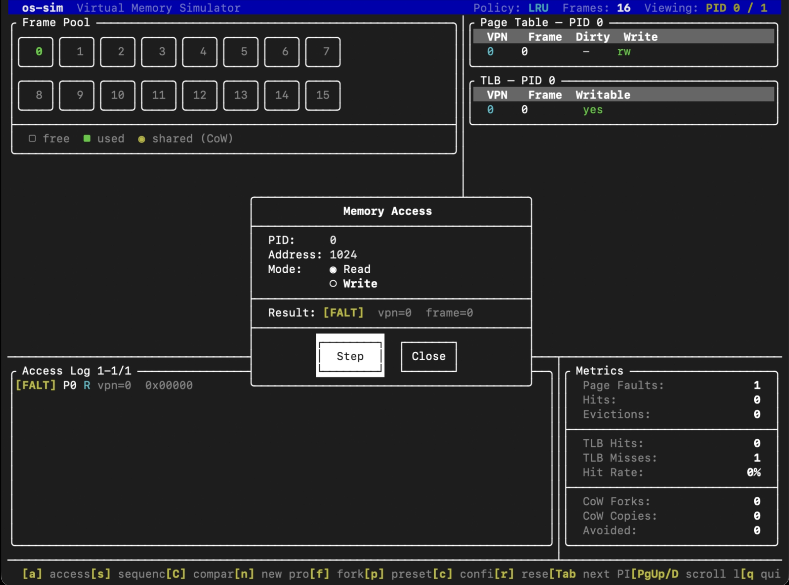
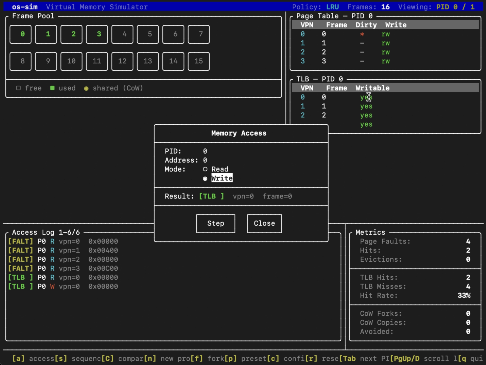
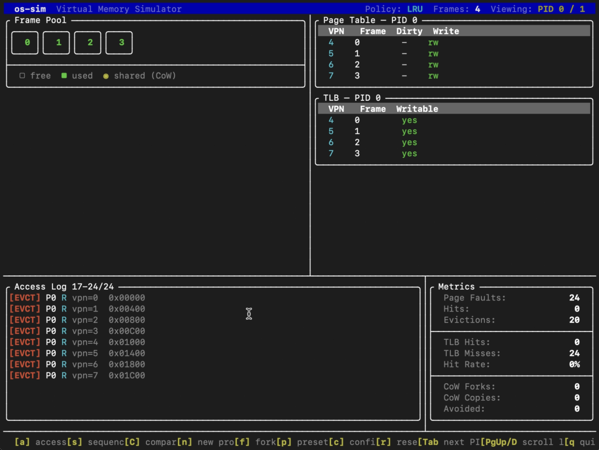
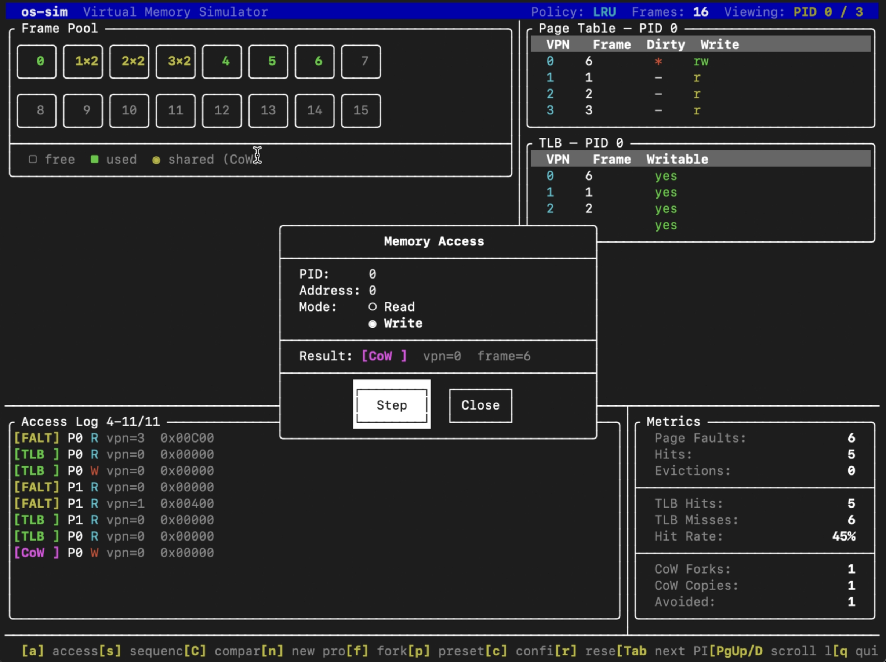

# os-sim

A virtual memory simulator written in C++17. Built to understand how operating systems manage physical memory — from frame allocation and address translation to page replacement and copy-on-write.

This was a personal project to solidify what I learned in my OS course.

---

## Interactive TUI

The simulator ships with a full-screen terminal UI built with [FTXUI](https://github.com/ArthurSonzogni/FTXUI). Every panel updates live after each step — frame pool, page table, TLB, access log, and metrics all reflect current simulation state in real time.

### Panels

| Panel | What it shows |
|-------|---------------|
| **Frame Pool** | Physical frames — grey=free, green=in use; CLOCK mode overlays a red hand cell and green/yellow reference-bit indicators; CoW-shared frames show `N×R` in yellow |
| **Page Table** | VPN→frame mapping for the viewed process, with dirty and writable flags |
| **TLB** | Cached translations for the viewed process; `[Tab]` cycles between processes |
| **Access Log** | Scrollable event history — `[FALT]` yellow / `[EVCT]` red / `[TLB ]` green / `[PT  ]` cyan / `[CoW ]` magenta |
| **Metrics** | Live counters: page faults, hits, evictions, TLB hit rate, CoW forks / copies / avoided |

### Controls

| Key | Action |
|-----|--------|
| `a` | Single memory access — PID, address (decimal or `0x` hex), R/W mode |
| `s` | Batch sequence run — type a space-separated VPN list; runs the full sequence against the current policy and shows a fault / TLB-hit / eviction summary |
| `C` | Algorithm comparison — runs the same sequence through FIFO, LRU, and CLOCK in isolated managers and shows a side-by-side results table; optional frame sweep (1–N frames) highlights Belady's anomaly |
| `n` | Create a new process — choose a flat, two-level, hashed, or inverted page table |
| `f` | Fork — parent + child PID; all frames shared via CoW |
| `t` | Page table structure panel — adapts to the viewed process: two-level shows the 8×4 L1 slot grid (arrows navigate, `t` expands entries), hashed shows an 8×8 bucket grid with chain lengths, inverted shows the global frame→(PID, VPN) table |
| `p` | Presets — 5 pre-built scenarios: Temporal Locality, Thrashing, CoW Read-Heavy, CoW Write-Heavy, CLOCK Second Chance |
| `c` | Config — switch algorithm (FIFO, LRU, CLOCK, WS) and frame count; WS adds a window-size field; takes effect immediately |
| `w` | Working set trim — frees frames outside the WS window (no-op for other policies); metrics panel shows live WS size and trim count |
| `r` | Reset — clears state, keeps current config |
| `Tab` | Cycle viewed PID in page table and TLB panels |
| `PgUp/Dn` | Scroll access log |
| `q` | Quit |

### Screenshots

**First page fault** — VPN 0 faults in and loads into frame 0; page table and TLB populate; `[FALT]` logged.



**Write access** — TLB hit on a previously loaded page; dirty bit set in the page table.



**Thrashing** — 4 frames, 8-page working set; every access evicts; 24 faults, 20 evictions, 0% TLB hit rate.



**Copy-on-Write** — after forking, a write to a shared page triggers `[CoW ]`; the frame pool splits the shared frame; one CoW copy recorded in metrics.



---

## What it simulates

**Virtual address translation**
Each process has its own page table mapping virtual page numbers to physical frame indices. The `MemoryManager` handles address translation, detects page faults, and loads pages into physical frames.

**Multi-level page tables**
Page tables are pluggable behind an `IPageTable` interface. The default `FlatPageTable` is a single hash map over the full VPN space. The `TwoLevelPageTable` splits the 10-bit VPN 5+5: the top 5 bits index a fixed 32-slot L1 directory, the bottom 5 bits index a 32-entry L2 table that is only allocated when a page in its range is first touched. A compact working set of 16 pages needs one L2 table; a sparse workload touching one page per L1 slot pays one full L2 table per page — the same space/locality trade-off real hierarchical tables make (x86-64 uses 4 levels of the same idea).

**Hashed and inverted page tables**
The `HashedPageTable` hashes the VPN into one of 64 buckets and chains collisions inside the bucket. Lookup is O(1) on average but degrades to a chain scan when many VPNs hash to the same bucket — an access stride equal to the bucket count is the pathological case. Probe counters make the degradation measurable.

The `InvertedPageTable` flips the indexing: one global table with a slot per physical frame recording which `(pid, vpn)` owns it, so its size scales with physical memory instead of virtual address space. Forward lookup (VPN → frame) requires scanning half the table on average, so a hash index over `(pid, vpn)` sits on top — the same fix real systems (PowerPC, PA-RISC) use. All processes created with an inverted table share the single global table through a per-process view. Fork is rejected for inverted processes: CoW sharing needs multiple owners per frame, and the inverted design records exactly one — a real limitation of inverted tables with shared memory.

**Physical frame management**
A `FramePool` manages a fixed set of physical frames. It tracks which frames are in use, maintains reference counts (for CoW sharing), and zeroes frames on deallocation.

**Page replacement policies**
When all frames are occupied and a new page must be loaded, a replacement policy picks the victim frame:

- **FIFO** — evicts the frame that has been in memory the longest
- **LRU** — evicts the frame that was least recently accessed, tracked with a doubly-linked list and hash map for O(1) updates
- **CLOCK** — approximates LRU using a reference bit per frame and a circular hand; recently accessed frames get one second chance before eviction, with no pointer manipulation on every access
- **OPT** — evicts the frame whose next use is farthest in the future (Belady's algorithm); requires the full access sequence upfront, so it serves as a theoretical lower bound on faults
- **Working Set** — tracks each frame's last access on a virtual clock; frames untouched for the last τ accesses fall out of the working set and `trim_working_set()` frees them even when free frames remain, modeling the phase behavior of real programs. Under eviction pressure it falls back to evicting the oldest frame

**Copy-on-Write (CoW)**
`fork_process(parent, child)` creates a child process that shares the parent's physical frames rather than copying them. All shared pages are marked read-only. On the first write by either process, the writing process gets its own private copy of that frame. Once only one process owns a frame, it becomes writable again with no further overhead.

Reference counts on frames track how many processes share each frame. A frame is only freed when its reference count reaches zero.

**Custom allocators**
Two allocator designs sit alongside the paging simulator, handling the variable-size allocation problem the frame pool doesn't:

- *Slab allocator* — built on top of the `FramePool`. Each slab is one physical frame carved into fixed-size objects from a size-class ladder (16–256 bytes). Allocation picks the smallest class that fits, pops a slot off the slab's LIFO free list in O(1), and grows the cache by one frame when every slab of that class is full. A slab whose last object is freed returns its frame to the pool. Fragmentation stats expose the cost of class round-up.
- *Buddy allocator* — manages a power-of-two pool of pages with one free list per block order. Allocation rounds the request up to a power of two and splits larger blocks down to size; freeing walks back up, merging each block with its buddy (`base XOR 2^order`) as long as the buddy is also free. Split and coalesce are both O(log n) with no scanning.

**Translation Lookaside Buffer (TLB)**
Each process has a 16-entry fully-associative TLB that caches recent virtual-to-physical translations. On every access the TLB is checked first; only on a miss does the simulator fall through to the page table. The TLB uses LRU eviction among its entries. When a page is evicted from physical memory all owning processes have their TLB entry for that page invalidated (TLB shootdown). CoW writes that relocate a page to a new frame update the TLB immediately so subsequent accesses hit without a page-table walk. The simulator tracks TLB hits, misses, and hit rate alongside the existing page-fault and eviction metrics.

---

## What I learned

- Why page tables exist and how virtual-to-physical translation works at the hardware/OS boundary
- The trade-offs between FIFO, LRU, and OPT — LRU is practical but still gets more faults than OPT; FIFO is simpler but suffers from Belady's anomaly (more frames can cause more faults)
- How LRU can be implemented in O(1) using a linked list + hash map rather than scanning all frames on every access
- How fork() in Unix systems avoids copying the entire address space by deferring copies until a write actually happens — and how reference counting makes this safe
- How metrics like copies-avoided show that CoW is most efficient under read-heavy workloads after a fork, and most costly when both processes immediately write to the same pages
- How the TLB acts as a cache in front of the page table, and why TLB coherence requires shootdowns when frames are evicted or CoW remaps a page to a new frame
- How TLB hit rate is driven entirely by access locality, not by whether pages are in memory — a tight 8-page working set gets 93.8% hit rate while a 32-page sequential scan (larger than the 16-entry TLB) gets 0%, the same thrashing dynamic that affects page replacement but one level up
- How TLB hit rate has a sharp cliff at the working-set boundary rather than a gradual curve — with a 20-page working set, TLB sizes of 4, 8, and 16 all get 0% (thrashing), while size 32 jumps to 90% because the full working set fits and the first-pass cold misses are amortized over all subsequent rounds
- How evictions and TLB hit rate are tightly coupled through shootdowns — with enough frames to hold the full working set there are zero evictions and a 90% hit rate, but reducing frames below the working-set size causes constant evictions that shoot down TLB entries faster than they can be reused, collapsing hit rate to 0%
- Why CLOCK is what real OS kernels use instead of LRU — exact LRU requires updating a recency structure on every single memory access, while CLOCK only sets a bit on access and does the recency work at eviction time; the approximation quality is close enough in practice that the per-access overhead saving dominates
- How multi-level page tables trade lookup depth for allocation laziness — the two-level table never stores entries for untouched address ranges, but the win depends entirely on locality: a compact 16-page working set costs one L2 table while the same 16 pages spread across the address space cost sixteen
- Why hashed page tables suit large sparse address spaces but live or die by the hash function — sequential pages cost 1 probe per lookup while an access stride equal to the bucket count chains everything into one bucket and costs 8.5
- Why inverted page tables are the only design whose size scales with physical memory instead of virtual address space — and why they need a hash index bolted on top to make forward lookup affordable, and struggle with shared memory since each frame slot records exactly one owner
- How the working set model separates "what to evict under pressure" from "what deserves to stay resident at all" — recency policies only act when frames run out, while working-set trimming returns memory as soon as a program's phase moves on, at the cost of refaulting if the old phase returns
- Why the kernel uses slabs for objects and buddy blocks for pages — slabs make same-size alloc/free O(1) with waste bounded by size-class round-up, while the buddy system's XOR trick makes coalescing O(log n) at the cost of rounding every request up to a power of two
- How external and internal fragmentation are two different failure modes — the buddy allocator can have half its pool free yet fail a 2-page request (external), while the slab allocator always satisfies requests but silently pads 24-byte objects to 32 (internal)

---

## Project structure

```
src/
  frame_pool.h/cpp         physical frame allocator with ref counting
  page_table_iface.h       IPageTable interface + PageTableEntry
  page_table.h/cpp         FlatPageTable: hash map over the full VPN space
  page_table_two_level.h/cpp  TwoLevelPageTable: 5+5 VPN split, L2 tables allocated on demand
  page_table_hashed.h/cpp  HashedPageTable: 64 chained buckets, probe counters
  page_table_inverted.h/cpp  InvertedPageTable: global frame-indexed table + per-process view
  tlb.h/cpp                per-process TLB: 16-entry fully-associative, LRU eviction
  memory_manager.h/cpp     core simulator: fault handling, CoW, TLB, metrics
  process.h                process abstraction (holds a page table and TLB)
  metrics.h/cpp            tracks faults, hits, evictions, CoW events, TLB hits/misses
  constants.h              PAGE_SIZE, NUM_FRAMES, TLB_SIZE, address space size
  policy/
    replacement_policy.h   abstract base class
    fifo.h/cpp
    lru.h/cpp
    clock.h/cpp            second-chance approximation of LRU
    opt.h/cpp
    working_set.h/cpp      sliding-window working set with proactive trimming
  alloc/
    slab_allocator.h/cpp   size-class object caches carved from frames
    buddy_allocator.h/cpp  power-of-two page allocator with buddy coalescing

tests/
  test_frame_pool.cpp
  test_page_table.cpp
  test_two_level_page_table.cpp  5 tests: L1 slot aliasing, shared L2 tables,
                           invalidate semantics, fault codes, flat-table parity
  test_hashed_page_table.cpp  7 tests: collision chaining, re-insert, probe
                           counting, fault codes, flat-table parity
  test_inverted_page_table.cpp  9 tests: per-pid isolation, occupant replacement,
                           linear vs indexed probes, MemoryManager integration, fork rejection
  test_working_set.cpp     8 tests: window expiry, trim behavior, refault after
                           trim, eviction fallback under pressure
  test_slab_allocator.cpp  10 tests: size classes, slab growth, LIFO slot reuse,
                           frame reclaim, double free, fragmentation stats
  test_buddy_allocator.cpp 10 tests: split cascade, buddy coalescing, round-up,
                           fragmentation blocking, exhaustion and reuse
  test_tlb.cpp             12 unit tests: lookup, insert, LRU eviction, invalidate, flush
  test_memory_manager.cpp  14 core tests + 5 TLB integration tests
  test_fifo.cpp
  test_lru.cpp
  test_clock.cpp           6 tests: second chance, access protection, fault count
  test_opt.cpp
  test_cow.cpp             14 tests covering fork, CoW reads, CoW writes,
                           last-owner write restoration, multi-page forks

tui/
  main.cpp                          FTXUI rendering, all modal components, keybindings
  simulator_state.h/cpp             thin wrapper around MemoryManager; captures AccessEvents
  comparison.h/cpp                  isolated policy comparison and frame-sweep logic + renderers

experiments/
  exp_utils.h                       shared table formatting
  exp_a_algorithm_comparison.cpp    FIFO vs LRU vs OPT on the same sequence
  exp_b_frame_sensitivity.cpp       how fault count changes as frame count grows
  exp_c_cow_read_heavy.cpp          fork + reads only — zero copies needed
  exp_d_cow_write_heavy.cpp         fork + writes to all pages — full copy cost
  exp_e_write_timing.cpp            pre-fork vs post-fork write cost comparison
  exp_f_tlb_locality.cpp            TLB hit rate vs access pattern locality
  exp_g_tlb_size_sweep.cpp          TLB hit rate vs TLB size (working-set cliff)
  exp_h_tlb_shootdown_cost.cpp      how evictions suppress TLB hit rate
  exp_i_page_table_comparison.cpp   flat vs two-level table space under sparse/compact workloads
  exp_j_hashed_collisions.cpp       hashed table probe cost under benign vs pathological strides
  exp_k_inverted_lookup.cpp         inverted table forward-lookup cost with and without hash index
  exp_l_working_set.cpp             working set trimming vs LRU across a phase change
  exp_m_slab_allocator.cpp          slab packing vs one frame per object
  exp_n_buddy_fragmentation.cpp     buddy fragmentation and coalescing cascade
```

---

## Future work

**Swap and backing store**
Evicted dirty pages currently vanish — a real OS writes them to disk and faults them back in with their contents intact. Adding a simulated swap file would make eviction cost asymmetric (clean pages are free to drop, dirty pages pay a writeback) and open the door to page-out daemons and prefetching.

**Slab on buddy**
The slab allocator draws whole frames from the frame pool and the buddy allocator manages its own page range; in Linux the slab layer sits on top of the buddy allocator. Wiring the slab's frame requests through buddy allocation would model the real kernel stack and let slab caches grow in multi-page chunks.

**TLB with ASIDs**
Each process owns a private TLB here. Real CPUs share one TLB tagged with address-space IDs, so a context switch doesn't flush everything. Modeling a shared tagged TLB would show the cost of context switches with and without ASIDs.

**Demand segmentation and memory-mapped files**
Regions with different permissions (code, heap, stack) and file-backed mappings would exercise the page-table designs against sparser, more realistic address-space layouts.

---

## Results

**Page replacement — algorithm comparison** (`exp_a`, sequence `[1,2,3,4,1,2,5,1,2,3,4,5]`, 3 frames)

```
Algorithm       Faults    Hits   Evictions
----------------------------------------------
FIFO                 9       3           6
LRU                 10       2           7
CLOCK                9       3           6
OPT                  8       4           5
```

CLOCK matches FIFO on this sequence and sits one fault above OPT, the theoretical minimum. LRU underperforms here due to Belady's anomaly on this specific access pattern. OPT serves as the lower bound — unachievable in practice since it requires knowing the future.

**TLB size vs hit rate** (`exp_g`, 20-page working set, 200 accesses)

```
  TLB Size    TLB Hits  TLB Misses    Hit Rate
----------------------------------------------
         4           0         200        0.0%
         8           0         200        0.0%
        16           0         200        0.0%
        32         180          20       90.0%
        64         180          20       90.0%
```

Hit rate is binary around the working-set boundary: TLB sizes below 20 thrash to 0%, size 32 jumps to 90% because the full working set fits and cold misses are only paid once. Doubling from 32 to 64 yields no further gain.

**Flat vs two-level page table** (`exp_i`, 16 pages accessed, 64 frames)

```
Sparse workload (each VPN in a different L1 slot):
Impl            Faults  Hits   Entries  L2 tables  L2 slots
----------------------------------------------
Flat                16     0        16          -         -
Two-Level           16     0         -         16       512

Compact workload (all VPNs in L1 slot 0):
Impl            Faults  Hits   Entries  L2 tables  L2 slots
----------------------------------------------
Flat                16     0        16          -         -
Two-Level           16     0         -          1        32
```

Fault behavior is identical — the table structure only changes where translations are stored. The space cost diverges: compact access needs a single 32-slot L2 table, while the sparse pattern allocates one L2 table per page touched.

**Hashed page table collisions** (`exp_j`, 64 buckets)

```
Workload                Entries  Max chain  Avg probes
----------------------------------------------
Sequential (0..15)           16          1        1.00
Strided (x64)                16         16        8.50
Full (1024 pages)          1024         16        8.50
```

Sequential VPNs spread evenly and cost one probe per lookup. A stride equal to the bucket count is pathological: all 16 entries chain in bucket 0 and the average lookup scans half the chain.

**Inverted page table forward-lookup cost** (`exp_k`, full table)

```
  Frames  Table slots  Linear probes   Indexed
----------------------------------------------
      16           16            8.5       1.0
      64           64           32.5       1.0
     256          256          128.5       1.0
    1024         1024          512.5       1.0
```

The table always has one slot per physical frame. Without the hash index, forward lookup scans half the table on average and grows linearly with memory size; the index makes it a single probe.

**Working set trimming across a phase change** (`exp_l`, two 8-page phases, 32 frames, window 12)

```
  Round  Phase        WS held   LRU held    Trims
----------------------------------------------
      5  A (0-7)            8          8        0
      6  B (8-15)          12         16        4
      7  B (8-15)           8         16        8
     10  B (8-15)           8         16        8
----------------------------------------------
Faults  WS: 16   LRU: 16
```

Both policies fault identically because frames are never scarce. The difference is footprint: after the phase change, working-set trimming frees the cold phase-A pages within two rounds, while LRU keeps all 16 pages resident because nothing ever forces an eviction.

**Slab allocator packing** (`exp_m`, 100 objects per size)

```
 Obj size Slab frames Naive frames    Slab util
----------------------------------------------
       16           2          100        78.1%
       24           4          100        58.6%
       64           7          100        89.3%
      200          25          100        78.1%
```

A naive allocator burning one 1024-byte frame per object wastes over 90% of every frame. Slabs pack objects of one size class per frame; the only waste is class round-up (24 → 32) and the tail of the last partially-filled slab.

**Buddy allocator fragmentation** (`exp_n`, 32-page pool)

```
Stage                   Free  Largest Alloc(2)
----------------------------------------------
fresh pool                32       32       ok
alloc 32 x 1 page          0        0    fails
free even pages           16        1    fails
free odd pages            32       32       ok
```

After freeing every other page, half the pool is free but no two free pages are adjacent, so a 2-page request fails — external fragmentation in its purest form. Freeing the odd pages lets every block merge with its buddy, cascading back to one 32-page block.

---

## Build

Requires CMake 3.15+ and a C++17 compiler.

```bash
cmake -S . -B build
cmake --build build
```

## Run the TUI

```bash
./build/os_sim_tui
```

## Run tests

```bash
./build/test_frame_pool
./build/test_page_table
./build/test_tlb
./build/test_fifo
./build/test_lru
./build/test_clock
./build/test_opt
./build/test_memory_manager
./build/test_cow
./build/test_two_level_page_table
./build/test_hashed_page_table
./build/test_inverted_page_table
./build/test_working_set
./build/test_slab_allocator
./build/test_buddy_allocator
```

## Run experiments

```bash
./build/exp_a    # algorithm comparison
./build/exp_b    # frame count sensitivity
./build/exp_c    # CoW read-heavy
./build/exp_d    # CoW write-heavy
./build/exp_e    # write timing
./build/exp_f    # TLB hit rate vs access locality
./build/exp_g    # TLB hit rate vs TLB size
./build/exp_h    # TLB shootdown impact on hit rate
./build/exp_i    # flat vs two-level page table
./build/exp_j    # hashed page table collisions
./build/exp_k    # inverted page table lookup cost
./build/exp_l    # working set trimming vs LRU
./build/exp_m    # slab allocator packing
./build/exp_n    # buddy allocator fragmentation
```